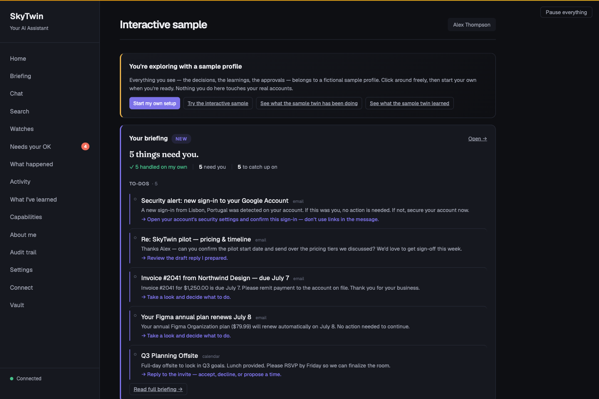

<div align="center">

# SkyTwin

**Open-source personal AI. A digital twin that learns what matters to you, with you in control.**

<a href="https://github.com/jayzalowitz/skytwin/actions/workflows/build.yml"></a>
<a href="https://github.com/jayzalowitz/skytwin/blob/main/LICENSE"></a>

<a href="https://github.com/jayzalowitz/skytwin/releases/latest"></a>


</div>

---

Imagine opening your day to a short list of what needs you, with the context already there: what happened, why it matters, and what your AI thinks you would want to do. Correct it once, and see what it learned.

That's the experience SkyTwin is building. Your **digital twin** is a growing model of your preferences, risk tolerance, and decision patterns. The goal is fewer repeated explanations and less routine decision work, with a visible reason behind each suggestion and clear limits on what it may do for you.

If personal AI already appeals to you, SkyTwin gives you a way to explore the next question: how should an assistant learn your judgment, earn permission to act, and stay accountable as it improves? You can inspect its memory, correct its assumptions, choose where reasoning runs, and adapt the source.

**[Explore SkyTwin](https://jayzalowitz.github.io/skytwin/) · [Take the five-minute tour](https://jayzalowitz.github.io/skytwin/how-to-use.html) · [Try it from source](https://jayzalowitz.github.io/skytwin/start.html)**

**Preview today:** explore the account-free fictional sample in current source. Google and Microsoft account connections are unavailable. Published unsigned installers are older than parts of this sample; start with the tour or source guide above.

[](https://jayzalowitz.github.io/skytwin/how-to-use.html)

*Actual app screenshot from a source development run, using fictional sample data. The messages, account indicators, and “handled” counts illustrate the product; no real account is connected and no real task was executed.*

## A personal AI you can get to know

The core principle is **ask the twin before asking the user**. The intended experience brings a few things together:

- **Know what needs you.** A briefing separates things to act on from things to catch up on, with the source behind each item.
- **Stop repeating yourself.** Preferences have supporting evidence, confidence, and a history you can inspect. You can see what the twin believes and correct it.
- **Understand the suggestion.** Review what happened, which preferences mattered, why an action was proposed, and how to change its mind.
- **Give it room at your pace.** The policy model starts with suggestions and checks trust, spend, risk, reversibility, and origin before considering an action. You decide what authority to grant.
- **Keep your choices yours.** Local reasoning is the default and does not silently fall back to a remote provider. Hosted reasoning is an explicit choice. The code is Apache-2.0 licensed.

The fictional sample lets you experience that review-and-correct loop today. Connected-account automation is the direction of the project; it is not available in the supported preview.

## Try the experience

Start with the [screenshot-led walkthrough](https://jayzalowitz.github.io/skytwin/how-to-use.html), or follow the [source start guide](https://jayzalowitz.github.io/skytwin/start.html) to explore the fictional sample yourself. You do not need an inbox, credentials, or an AI provider key.

1. **Meet the sample twin.** Open the fictional profile's briefing and see what
   needs a decision, alongside what is just useful to know.
2. **Follow a suggestion.** Inspect a decision, the evidence behind it, and the
   explanation of why it needs approval.
3. **Try a correction.** Use the sample's simulated approve, reject, or correct
   controls and see the session-local learning. The product views are read-only;
   these interactions have no provider, connector, or execution-adapter effects.
4. **Explore what it remembers.** Visit “What I've learned” to see the preferences
   behind the suggestions. Think about which of your own routines you would want
   a twin to learn.

For a plain-language walkthrough, begin with [how to use the fictional sample](https://jayzalowitz.github.io/skytwin/how-to-use.html), then use the [documentation site](https://jayzalowitz.github.io/skytwin/docs.html):
[how to start](https://jayzalowitz.github.io/skytwin/start.html),
[how safety works](https://jayzalowitz.github.io/skytwin/safety.html),
[where inference runs](https://jayzalowitz.github.io/skytwin/inference.html),
and the [five-minute fictional-data demo](https://jayzalowitz.github.io/skytwin/demo.html).

## Where this is headed

These examples explain the intended judgment model; they are not a list of
workflows included in the current desktop artifacts. The beta release contract
below limits launch support to workflows backed by tagged-artifact evidence.

| Future scenario | Intended experience |
|----------|-------------------|
| **Newsletter arrives** | Your twin recognizes your archive pattern and proposes moving the message out of the Inbox. You confirm before the mailbox changes, and the explanation is logged. |
| **Calendar conflict** | You always prioritize skip-level 1:1s over standups. Standup rescheduled with a note to the organizer. |
| **Subscription renewal** | $15.99/mo streaming service, used 3x this month, 18 months of renewals. Auto-renewed within your spend norms. |
| **Grocery reorder** | Repeats your last order with your substitution rules. Flags the one item that jumped 15% in price. |
| **Flight booking** | Finds the United aisle seat, morning departure, direct, $380. At high trust: books it. At low trust: presents top 3 options. |
| **Unknown sender email** | Low confidence. Escalates with a one-line summary so you can decide in 5 seconds instead of 5 minutes. |

## What makes the twin yours

**Conversation connects to decisions.** SkyTwin includes chat and an “Ask your twin” surface. Its broader goal is to bring the same personal context into briefings, suggestions, and eventually connected-account actions, so useful work can begin without a new prompt each time.

**Trust grows domain by domain.** New users start at `observer` — the system only suggests. Its trust model lets approvals and corrections inform autonomy separately for each domain; trust in email triage need not imply trust with your calendar. See the [policy types](./packages/shared-types/src/policy.ts) and [policy engine](./packages/policy-engine/src/).

**Safety constraints are the product.** Typed candidate-action paths through the policy engine apply spend limits, trust-tier gating, reversibility checks, and sensitivity classification; the release-wide entry-path inventory remains a beta gate. The system can be inspected, overridden, narrowed, and shut off at any time. [Read the full safety model →](./docs/safety-model.md)

**Recorded decisions are inspectable.** Supported paths can produce an explanation record covering what happened, the evidence and preferences used, the selected action, and correction guidance. Release-wide explanation coverage is still under audit, and a hosted model's internal reasoning remains subject to that provider's own transparency limits.

**Your twin is inspectable.** It's not a vector embedding or a bag of keywords. It's a typed, versioned data structure where every preference has a confidence level, supporting evidence, and provenance. Contradictions are tracked, not hidden.

**Memory knows who said what.** Signals from supported connectors arrive stamped with an authoring tier — content you wrote vs. a newsletter vs. an inbound stranger — and tier-weighted retrieval lets self-authored content outrank broadcast noise. The twin feels like it knows *you* instead of just having read your inbox.

**You can teach a Watch.** The source includes versioned, read-only signal-digest workflows: describe what to watch for, replay a candidate, compare revisions, and explicitly activate or roll back a version. These are a separate development surface, outside the disposable sample credential. Model-assisted authoring requires a qualified model, artifact, and runtime build; the current catalog's downloadable model has not cleared that quality gate. [Explore Watches →](https://jayzalowitz.github.io/skytwin/workflows.html)

## Go deeper when you're ready

| If you want to… | Start here | Then go deeper |
|---|---|---|
| Understand the idea without installing anything | [Documentation site](https://jayzalowitz.github.io/skytwin/) | [Plain-language FAQ](https://jayzalowitz.github.io/skytwin/faq.html) and [glossary](https://jayzalowitz.github.io/skytwin/glossary.html) |
| See the product model safely | [Five-minute fictional-data walkthrough](https://jayzalowitz.github.io/skytwin/how-to-use.html) | [Safety model](https://jayzalowitz.github.io/skytwin/safety.html) and [data guide](https://jayzalowitz.github.io/skytwin/data.html) |
| Run and inspect the source | [Source start guide](https://jayzalowitz.github.io/skytwin/start.html) | [Operations guide](https://jayzalowitz.github.io/skytwin/operations.html) and [troubleshooting](https://jayzalowitz.github.io/skytwin/troubleshooting.html) |
| Extend it with tools or agents | [Agent and MCP guide](https://jayzalowitz.github.io/skytwin/agents.html) | [Architecture](https://jayzalowitz.github.io/skytwin/architecture.html) and [reference](https://jayzalowitz.github.io/skytwin/reference.html) |

The rest of this README covers installation, source architecture, deployment, and release status. The [full documentation index](#documentation) keeps every technical guide within reach.

## Quick Start

### Build from source (one-command, macOS / Linux / WSL)

```bash
curl -fsSL https://raw.githubusercontent.com/jayzalowitz/skytwin/main/install.sh | bash
```

The installer detects your OS, installs anything missing (Homebrew on mac, Node 20+, pnpm), fetches the official CockroachDB single-node binary (hash-verified), clones the repo to `~/skytwin`, runs the bootstrap, starts the services, and opens the dashboard at `http://localhost:3200` once it's up. Re-running pulls latest and restarts.

The command above intentionally follows the moving `main` branch. For a
reviewable, immutable source evaluation, use the exact-commit archive workflow
in [Internal Source Candidates](./docs/internal-source-candidates.md). Those
archives are source-only internal materials, not public releases, and preserve
the existing signed-artifact beta gate.

**No Docker required.** Before v0.6.56 the installer pulled Docker Desktop and ran CockroachDB inside a container — by far the heaviest dependency on the list, with its own EULA and a "open it once after install" gotcha. The default path now installs the CRDB binary directly into `~/.local/share/skytwin/bin/cockroach` and spawns it as a child process. Docker remains supported via `SKYTWIN_USE_DOCKER=true` for users who already have a Docker workflow.

To stop later: `cd ~/skytwin && ./bin/skytwin-dev --stop`.

**The first 60 seconds in a development/source run:**
1. The dashboard opens. "Ask your twin" can show a predicted action, confidence, alternatives, and an explanation; the exact model-backed path depends on an available local runtime or provider, while deterministic fallbacks cover supported paths when no model responds.
2. After `pnpm db:seed`, click **"Just show me around"** on the welcome screen to skip OAuth and use the development demo seed. Alex has recent decisions, a daily briefing, four pending approvals, "What I've learned", Capabilities, Search, and a trust bar climbing toward "handle most things". The development seed also includes Pat (a power user) and Carol (a brand-new user), so the dev "Switch user" button tells three stories. This development path can exercise mock approval actions; it is separate from the packaged build's read-only data authority and isolated, non-persistent simulation.
3. The welcome screen recommends a local model from the machine's RAM, architecture, and free disk. The current maintained catalog contains one pinned Qwen2.5 1.5B Instruct Q4_K_M artifact (about 1.0 GiB). The artifact is downloaded on request and must pass exact-size, SHA-256, registry, and runtime-compatibility checks before automatic discovery will load it. A compatible llama.cpp binary remains a separate prerequisite. The artifact remains available for ordinary local inference but is not qualified for adaptive-workflow authoring because it did not clear the checked-in quality gate. "Change" opens Settings → AI (and the local memory backend).
4. Want to look around first? Press **Esc**, click the **×** in the modal corner, or hit **Skip for now** — the dashboard chrome stays navigable behind the modal, and a "Sign in" button on the placeholder gets you back into the wizard whenever you're ready.
5. Google and Microsoft account connection controls are intentionally unavailable in this preview.
   Real-account setup is not supported; use the isolated sample while the OAuth
   and credential-custody boundaries are completed.

### Advanced env vars

The default source install starts SkyTwin's core services without Docker or a
hosted-model API key. Model-backed reasoning still requires an available local
runtime plus verified model artifact, or a provider you configure. Power users can opt into:

| Env var | Effect |
|---------|--------|
| `SKYTWIN_USE_DOCKER=true` | Run CockroachDB inside Docker instead of as a native binary. Useful for users who already have Docker and prefer container lifecycle. |
| `SKYTWIN_DOCKER_SQL_PORT`, `SKYTWIN_DOCKER_ADMIN_PORT`, `SKYTWIN_DOCKER_API_PORT` | Override Docker Compose host ports for SQL, the Cockroach admin UI, and the optional API container. Useful when another Conductor workspace or local stack already owns `26257`, `8080`, or `3000`. |
| `TURBO_DEV_CONCURRENCY` | Override the `pnpm dev` Turbo concurrency. The default is `50`, high enough for the current persistent dev task count. |
| `SKYTWIN_DEV_SKIP_PORT_PREFLIGHT=1` | Bypass the `pnpm dev` port preflight. Use only when you intentionally want Turbo to try starting even though a required dev port is already listening. |
| `SKYTWIN_WITH_OLLAMA=true` | Install Ollama + pull the gemma4 model (~9.6GB). Without this opt-in, local inference requires a separately installed `llama.cpp` binary and compatible model. |
| `SKYTWIN_DISABLE_EMBEDDED=1` | Skip the embedded LLM provider in the API's provider chain. Pair with hosted-only keys (e.g. `ANTHROPIC_API_KEY`) for reproducible evaluation runs. |
| `SKYTWIN_LLAMA_MODEL=/path/model.gguf` | Opt into a user-managed model path. This explicit override bypasses the managed-model manifest and registry checks; the user is responsible for the artifact's provenance and compatibility. |
| `SKYTWIN_REASONING_MODE` | Pin the environment-driven chain to `on_device` or `bring_your_own_provider`. Mixed local/remote chains require this explicit choice. Verified private cloud is configured per user in Settings so its key and isolated provider snapshot are explicit. |
| `SKYTWIN_CRDB_VERSION` | Pin a non-default CockroachDB version. Refresh the hash tables in `bin/skytwin-db` and `apps/desktop/scripts/build-single-binary.sh` together. |

On-device Ollama requires Ollama 0.18 or newer. SkyTwin adds Ollama's
request-scoped `:local` source selector to every on-device call and never
retries the unqualified model name; this prevents a loopback daemon from
relaying a remote-backed model alias. General local chat is supported, but
released Ollama builds do not attest the exact served digest/runtime on each
chat response, so adaptive workflow authoring and summaries currently fail
closed. For defense in depth, disable Ollama Cloud globally with
`OLLAMA_NO_CLOUD=1` or `disable_ollama_cloud: true`.

### Manual setup

If you'd rather drive each step yourself:

**Prerequisites**

- [Node.js](https://nodejs.org/) >= 20
- [pnpm](https://pnpm.io/) >= 9
- That's it. CockroachDB is fetched as a native binary by `bin/skytwin-db install`. No Docker, no system DB install.

```bash
git clone https://github.com/jayzalowitz/skytwin.git && cd skytwin
pnpm install

# Fetch + start CockroachDB (native binary, hash-verified)
./bin/skytwin-db install
./bin/skytwin-db start
./bin/skytwin-db ensure-db

# Configure
cp .env.example .env   # edit with your values

# Migrate and seed
pnpm db:migrate
pnpm db:seed

# Build and run
pnpm build
pnpm dev
```

The API starts on `localhost:3100`, the web dashboard on `localhost:3200`.
`pnpm dev` preflights the API, web, OpenClaw bridge, and Twin MCP ports before
Turbo starts. If another process owns a required port, it prints the owning
PID/command/cwd; if this same workspace is already healthy, it exits cleanly
instead of starting a duplicate dev stack.
The OpenClaw bridge is supervised during `pnpm dev`, so a one-off child
SIGKILL/exit 137 restarts the bridge without tearing down API/web/worker; fast
crash loops still fail visibly.

### Validating the install path

Before shipping, regression-check the install end-to-end across a matrix
of Linux distros:

```bash
./bin/validate-installs              # Ubuntu 22.04, Debian 12, Fedora 40
./bin/validate-installs ubuntu       # one distro
./bin/validate-installs --keep-on-fail ubuntu  # leave container alive on failure
```

Each run spawns a fresh OS container, untars a snapshot of the working
tree, runs `install.sh` exactly the way a real user would, and asserts
the dashboard responds at `localhost:3200`. macOS/Windows are exercised
via the same `install.sh` and `bin/skytwin-db` codepaths but need a real
machine to verify the platform-specific bits (Homebrew, NSIS, etc.).

### Running Tests

```bash
pnpm test   # 4,800+ tests across 400+ files in 31 packages + 8 apps
```

### Older desktop technical-preview downloads

**[View the latest published release →](https://github.com/jayzalowitz/skytwin/releases/latest)**

Current desktop artifacts bundle CockroachDB as a hash-verified native binary,
but they are unsigned technical previews rather than supported public-beta
installers. The tagged release path can generate and attach updater manifests,
but no qualifying beta release is currently published; do not infer manifest
presence or update support from the current preview. Check the release notes for
the exact features in an artifact. In
builds from current source, a local model and the `llama.cpp` runtime are not
bundled: SkyTwin can recommend a maintained artifact for the machine and download
it only after the user starts the install. A compatible runtime remains a separate
prerequisite, while a hosted provider remains an explicit opt-in.

> **Release boundary:** published installers currently predate the guarded,
> account-free sample session and verified managed-model delivery in this source
> tree. Check the release notes for the exact features in an artifact. Desktop
> builds produced from current source
> can open a short-lived sample whose database-backed surface remains read-only;
> approve, reject, correct, and learn interactions run only in a separate,
> session-local simulation that cannot reach providers or execution adapters.
> Its browser credential is tab-scoped and [bypasses offline caching and replay](./apps/web/public/js/pwa/sw-policy.js).

| OS | Installer on the release page |
|----|-------------------------------|
| **macOS** (Apple Silicon) | `SkyTwin-…-arm64.dmg` |
| **Windows** | `SkyTwin.Setup.….exe` |
| **Linux** | `SkyTwin-….AppImage`, `.deb`, or `.rpm` |

> **⚠ Unsigned builds (for now).** Code-signing certs (Apple Developer + Windows EV) are a pending launch step, so your OS warns on first launch:
> - **macOS:** right-click the app → **Open** → **Open** (clears Gatekeeper once).
> - **Windows:** SmartScreen → **More info** → **Run anyway**.
>
> Signing and notarization are stop-ship requirements for a supported public beta.

## How It Works

This is the source architecture and intended connected-account pipeline. The
supported preview feeds it only isolated fictional sample data; Google and
Microsoft account connections are unavailable.

```
  Gmail, Calendar, etc.
         │
         ▼
  ┌──────────────┐
  │   Connectors  │  Ingest signals from your accounts
  └──────┬───────┘
         ▼
  ┌──────────────┐
  │   Decision    │  "What's happening? What would
  │   Engine      │   the user want here?"
  └──────┬───────┘
         ▼
  ┌──────────────┐
  │  Twin Model   │  Your preferences, patterns,
  │  + Memory     │  and episodic memory (gbrain default,
  │               │  MemPalace optional)
  └──────┬───────┘
         ▼
  ┌──────────────┐
  │   Policy      │  Spend limits, trust tiers,
  │   Engine      │  safety constraints
  └──────┬───────┘
         ▼
    ┌────┴────┐
    ▼         ▼
 Auto-     Escalate
 execute   with context
    │         │
    ▼         ▼
 Explain   You decide
    │         │
    └────┬────┘
         ▼
  ┌──────────────┐
  │  Feedback     │  Your response trains the twin
  │  Loop         │  to be better next time
  └──────────────┘
```

Supported decision paths can persist explanation and feedback records. Release-wide coverage is still being audited before the public beta.

## Architecture

SkyTwin is a TypeScript monorepo (pnpm + Turborepo) with 31 packages and 8 apps:

```
apps/
  api/                HTTP API — decisions, user management, webhooks, /api/voice/*
  web/                Dashboard — review decisions, manage preferences, configure policies
  worker/             Background jobs — async execution, briefing generation, memory action loop, tier backfill
  idle-miner-runner/  Desktop-managed child that scans approved project roots only while the machine is idle
  desktop/            Electron app — macOS (.dmg), Windows (.exe), Linux (.AppImage)
  mobile/             React Native (Expo) — QR pairing, push notifications, SSE, voice capture
  openclaw-bridge/    OpenClaw proxy — bridges local API to OpenClaw execution service
  twin-mcp-server/    MCP server exposing the twin's read-only surface to external clients

packages/
  shared-types/                   TypeScript interfaces — the dependency root for everything
  config/                         Env var loading and validation
  core/                           Retry logic, circuit breaker, error types, logging
  db/                             CockroachDB client, migrations, repositories
  twin-model/                     Twin profile CRUD, preference learning, confidence scoring
  decision-engine/                Event interpretation, candidate generation, action selection
  policy-engine/                  Trust tiers, spend limits, domain policies, safety checks
  policy-prompts/                 Versioned LLM prompts with JSON schema validation and deterministic fallbacks
  ironclaw-adapter/               Execution adapter with HMAC auth, retries, circuit breaker
  execution-router/               Adapter selection, fallback chains, risk modifiers, plugin discovery
  llm-client/                     Unified LLM client — local, conventional, and admitted TrustedRouter paths; NEAR represented but blocked
  near-confidential/              Fail-closed NEAR verification contract; no transport is runtime-admitted
  embedded-llm/                   Local-first: llama.cpp text, whisper.cpp STT, Piper TTS — spawn-based
  explanations/                   Human-readable explanation generation
  connectors/                     Gmail / Google Calendar / Outlook mail+calendar / mock connectors; account providers disabled in supported preview
  assistant/                      Stateless chat service wrapping LlmClient with context enrichment
  capability-engine/              Infers user app capabilities from signals (keyword v1 + LLM verification)
  credential-vault/               AES-256-GCM + scrypt primitives for the experimental token vault (not production-default encryption)
  idle-miner/                     Filesystem scanner that extracts project metadata during idle time
  mcp-host/                       Manages MCP servers (stdio/HTTP/SSE) with circuit breakers + telemetry
  dxt/                            Serializes/deserializes DXT artifacts (packed MCP server configs)
  observability/                  In-memory metrics + ring-buffered rollup for the capability loop
  registry-client/                Loads curated MCP registry entries with OAuth quirks and service lookup
  routines/                       Typed read-only Watch providers: canonical payloads, compilation, replay, semantic diff, and run evidence
  mempalace/                      Legacy memory: episodic, knowledge graph, 4-layer retrieval (opt-in backend)
  memory-port/                    Backend-agnostic MemoryPort interface + capability negotiation
  memory-gbrain/                  Default gbrain-compatible backend on CRDB; upstream CLI interoperability adapter (never runtime-selected)
  memory-gbrain-crdb-adapter/     CRDB driver for gbrain — tier-weighted RRF, pin/hide, embedding providers
  memory-hybrid/                  Composes any two MemoryPort impls — per-capability read routing
  memory-mempalace/               MemoryPort adapter for the legacy mempalace classes
  evals/                          Decision quality evaluation and regression testing
```

### Tech Stack

| Layer | Technology |
|-------|-----------|
| Language | TypeScript (strict, ES2022) |
| Database | CockroachDB (PostgreSQL wire protocol) |
| Runtime | Node.js >= 20 |
| Package Manager | pnpm with workspaces |
| Build | Turborepo |
| Desktop | Electron + electron-builder |
| Mobile | React Native + Expo |
| Testing | Vitest (4,800+ tests) |
| CI/CD | GitHub Actions |
| Execution | [IronClaw](https://github.com/nearai/ironclaw/), OpenClaw (via local bridge), and Direct execution — trust-ranked selection with ambiguous attempts held for reconciliation |

## Deployment

### Reverse proxies and `TRUST_PROXY_HOPS`

The API uses `req.ip` for every IP-keyed check: the session-auth
localhost dev-bypass, the OAuth new-user rate limit, the
`/api/v1/demo/preview` per-IP bucket, and any future per-client limit.
Behind any reverse proxy, `req.ip` is the proxy's address by default —
which collapses every per-IP limit into a single shared bucket. You
need `TRUST_PROXY_HOPS` set to the exact number of trusted hops between
the Node process and the real client.

The number you want is "trusted proxies between this Node process and the
actual client" — count every box that legitimately appends to
`X-Forwarded-For` on its way in, including any platform-injected router
your provider sits behind.

| Topology | `TRUST_PROXY_HOPS` |
|----------|--------------------|
| Direct (no proxy, or untrusted upstream) | `0` (default) |
| Single reverse proxy (your own nginx, Caddy, ELB target) | `1` |
| Single platform hop (Fly's edge, Render's router, Heroku's app router, an AWS ALB on its own) | `1` |
| CDN → your reverse proxy (Cloudflare → nginx → Node, no platform router) | `2` |
| CDN → platform router → Node (Cloudflare → Fly/Render/Heroku → Node) | `2` |
| CDN → platform router → your reverse proxy → Node (Cloudflare → Fly → nginx → Node) | `3` |
| Multi-hop edge (Cloudflare → AWS WAF → ALB → Node) | `3+` |

If you can't draw the topology from memory, prefer Express's array/CIDR
form for `trust proxy` (set per-network, not per-hop) — see the
[Express docs](https://expressjs.com/en/guide/behind-proxies.html). Hop
counts are simple but brittle when a platform inserts a hop you didn't
know about.

**Setting this too high is a security hole.** A client-controlled
`X-Forwarded-For` becomes `req.ip` and bypasses every per-IP limit by
header rotation. **When in doubt, prefer fewer hops.**

Verify after deploy:

```bash
curl -H 'X-Forwarded-For: 1.2.3.4' https://your-api/api/health/live
# response includes {"clientIp": "..."} — should NOT be "1.2.3.4"
# unless 1.2.3.4 is actually a trusted upstream
```

If `clientIp` in the response matches the spoofed header, your
`TRUST_PROXY_HOPS` is too permissive and rate-limit bypass is open.

### Public demo preview (`/api/v1/demo/preview`)

The public LLM-backed preview endpoint has three layers of protection:

| Env var | Default | Purpose |
|---------|---------|---------|
| `DEMO_PREVIEW_DISABLED` | unset | Set to `1` to return 503 unconditionally — operator kill switch when the endpoint gets abused. |
| `DEMO_PREVIEW_GLOBAL_LIMIT_PER_HOUR` | `500` | Hard global cap across all callers. Survives misconfigured `TRUST_PROXY_HOPS` and rotated-IP abuse. |
| Per-IP bucket | 20 / 5 min | Built in. Effectiveness depends on `TRUST_PROXY_HOPS` resolving the real client IP. |

The per-IP bucket and the global cap are process-local. If you run
multiple API replicas, the global cap multiplies by replica count.
For unauthenticated public deployments at scale, replace the
in-memory counter with Redis or a DB row with atomic increment
(tracked in TODOS.md as a P3).

## Trust Tiers

SkyTwin uses a progressive trust model. Autonomy is earned, not assumed.

| Tier | What It Means |
|------|---------------|
| `observer` | Default for new users. The twin proposes actions and surfaces them as approval requests — you approve, reject, or edit. Never auto-executes. |
| `suggest` | Drafts actions for your review. You approve or edit before anything happens. |
| `low_autonomy` | Auto-executes low-risk, reversible actions in trusted domains. Escalates everything else. |
| `moderate_autonomy` | Handles most routine decisions. Escalates novel situations and high-cost actions. |
| `high_autonomy` | Acts on your behalf across domains. Still respects hard limits and irreversibility checks. |

Trust is **domain-specific**. You might be at `moderate_autonomy` for email but `suggest` for calendar. A bad decision in one domain can reduce trust in that domain without affecting others.

## Documentation

| Document | What's Inside |
|----------|---------------|
| [How to Use the Fictional Sample](https://jayzalowitz.github.io/skytwin/how-to-use.html) | A plain-language, screenshot-led tour of the current source development sample. It identifies its fictional data and distinguishes it from published technical-preview installers. |
| [FAQ and Glossary](https://jayzalowitz.github.io/skytwin/faq.html) | Direct answers and defined terms for preview status, safety, privacy, inference, agents, and the release boundary. |
| [Data and Memory Guide](https://jayzalowitz.github.io/skytwin/data.html) | Current storage disclosure, credential separation, backup/restore semantics, memory backends, and control boundaries. |
| [Integration Status](https://jayzalowitz.github.io/skytwin/integrations.html) | What is available in the fictional sample, how local MCP and admitted execution differ, and which connector or DXT surfaces remain unavailable or forward-looking. |
| [Troubleshooting](https://jayzalowitz.github.io/skytwin/troubleshooting.html) | Source-run baseline checks, migrations, seeding, local build recovery, ports, and safe issue-reporting guidance. |
| [Documentation Site](https://jayzalowitz.github.io/skytwin/docs.html) | Human evaluation guides plus architecture, safety, inference/privacy, MCP-agent, operations, release-evidence, and contribution references. The Pages site is source-first; GitHub remains canonical for implementation details. |
| [Versioned Workflows](https://jayzalowitz.github.io/skytwin/workflows.html) | Public guide to teaching, replaying, explicitly activating, immutably revising, and rolling back the current read-only signal-digest workflow; the full source contract remains in [Adaptive Workflows](./docs/adaptive-workflows.md). |
| [The Deck](https://jayzalowitz.github.io/skytwin/deck.html) | 22 slides: every capability claim paired with the mechanism that constrains it. Each claim-and-gate slide carries a collapsible source block citing the file and lines it came from; the "why now" and positioning slides cite external sources instead, and three narrative slides carry no citation block ([source](./docs/deck.html)) |
| [Product Spec](./docs/product-spec.md) | Vision, target user, operating principles, example workflows |
| [Adaptive Workflows](./docs/adaptive-workflows.md) | Canonical source contract for immutable signal-digest workflows, model qualification, exact run evidence, backup/restore, and CockroachDB invariants |
| [Technical Spec](./docs/technical-spec.md) | Architecture, data flow, API endpoints, database schema |
| [Safety Model](./docs/safety-model.md) | Threat model, trust tiers, defense layers, safety philosophy |
| [Inference Receipts](./docs/inference-receipts.md) | Versioned receipt contract, decision-event capture, developer verifier, trust boundary, and current UI/export limitations |
| [Confidential Inference](./docs/confidential-inference.md) | Local-first admission, fail-closed TrustedRouter, and why NEAR AI remains verification-pending |
| [Decision Engine](./docs/decision-engine.md) | Situation interpretation, risk assessment, confidence scoring |
| [IronClaw Integration](./docs/ironclaw-integration.md) | Execution adapter, HMAC auth, failure handling |
| [CockroachDB Architecture](./docs/cockroach-architecture.md) | Schema design, query patterns, versioning, receipt and effect boundaries |
| [Evals](./docs/evals.md) | Evaluation harness, scenario simulation, calibration metrics |
| [Launch Plan](./docs/launch-plan.md) | Procurement + sequencing to public download links |
| [Launch-Readiness Report](./docs/launch-readiness-report.md) | Historical audit with a current account-free launch override; the claim ledger remains authoritative |
| [Release Procedure](./docs/release-procedure.md) | How the evidence-gated tag workflow verifies and publishes a release |
| [Beta Claim Ledger](./docs/beta-claim-ledger.json) | Machine-checked release contract, evidence, limitations, owners, and stop-ship status |

## Current preview and account boundaries

Public [source-preview snapshots](https://github.com/jayzalowitz/skytwin/releases)
use date-based `source-preview-*` tags and contain source only, not desktop
installers. They are a way to try an exact revision with local development tools;
they do not certify the planned public beta. See the
[release guide](https://jayzalowitz.github.io/skytwin/release.html#source-preview).

The isolated, account-free fictional-data sample in current source is the
supported preview. It lets you evaluate the interaction model, explanations,
controls, and boundaries without giving SkyTwin an inbox, credentials, or a
provider key. Published unsigned technical-preview installers predate portions
of this guarded sample path.

The [Start guide](https://jayzalowitz.github.io/skytwin/start.html) explains what
the installer changes locally. The sample is intentionally separate from real
accounts: its product views are read-only, and its approve/reject/correct
interactions are session-local simulations with no provider, connector, or
execution-adapter effects.

A candidate action is evaluated against policy, trust, spend, risk,
reversibility, and provenance. A model suggestion is never the authority to run
work. Local reasoning does not fall through to a hosted provider. A hosted
provider is an explicit network choice. The verified-private boundary admits
only explicit interactive TrustedRouter calls after SkyTwin verifies fresh
same-session gateway attestation and an exact-byte confidential-route receipt;
NEAR AI remains unavailable.

Google and Microsoft account connections are unavailable on the supported surface. SkyTwin does not ship a managed Google OAuth client, and operator/BYO Google remains unsupported until its callback, client-generation, capability, ownership, and secret-custody gates are complete. Known account-backed email/calendar actions are denied before adapter preparation or dispatch while this boundary is active. Stale account capability rows and imported account-backed tool bundles are also withheld from activation. Connector code in the source tree is not a support claim.

The source tree also contains a default-off Gmail archive proposal experiment
(`SKYTWIN_GMAIL_ARCHIVE_ENABLED=true`) for unsupported account-connected
development. It can persist an owner-bound proposal and record an explicit
approval or rejection, but the response deliberately reports
`execution: null`: no Gmail mutation caller, recovery worker, or feedback
projection is wired into runtime yet. Enabling the flag is not an execution or
release-support claim.

## Project Status

SkyTwin is preparing a desktop-first `v0.7.0-beta`. It is **not release-ready**:
fresh packaged-sample and managed-model validation, production key management,
signed/notarized artifacts, SBOMs, provenance, and clean-machine evidence remain
stop-ship items. The machine-checked
[`docs/beta-claim-ledger.json`](./docs/beta-claim-ledger.json) is the source of
truth for release claims and support status. Current builds remain technical
previews and published installers predate the guarded sample and verified managed
model source paths. The core decision pipeline, twin model, policy engine, and
swappable memory layer are implemented. Google connector and OAuth code exists in
source but is disabled on the supported sample-only preview; managed Google access
is deferred, and operator/BYO use is not yet supported. Mobile remains a
source/development surface rather than part of the beta support matrix.
The supported beta topology is one non-demo human owner per installation.
Installation credentials and dynamically discovered credential requirements are
shared installation configuration; local multi-owner and hosted deployments are
outside the beta support boundary.

**Free and open-source forever for personal use.** Team and hosted tiers are planned for organizations that need shared policies, audit logs, or managed infrastructure — see [`docs/launch-plan.md`](./docs/launch-plan.md) for the split.

**What works in the development/source tree today:**
- One-command install (`curl | bash`) on macOS, Linux, and WSL — installs every dependency, clones the repo, starts the services, opens the dashboard
- "Ask your twin" widget on the dashboard — type any situation, get a predicted action with reasoning and confidence, no accounts required
- A fully populated development demo seed with mock approval actions, plus a separate guarded sample session for packaged desktop builds. Its database-backed surface is read-only; a dedicated simulation can approve, reject, or correct fixed proposals and demonstrate session-local learning without invoking real connectors, providers, credentials, or execution adapters. Current published installers predate this packaged sample path.
- Inbox-Intelligence briefing — a daily/weekly digest that splits **to-dos (act)** from **topics (FYI)**, cites the source signal behind every item, persists memory-derived action opportunities, routes them through policy plus IronClaw/OpenClaw/Direct execution, reports queued/executed/blocked/learning-needed outcomes, and offers a "Power view" toggle for the technical detail behind each call
- Versioned signal-digest workflows — teach a read-only Watch in plain language, resolve at most one missing detail, replay the candidate against real owner-scoped signals, explicitly activate an immutable version, propose a minimal correction, compare the replay, and atomically roll back. Every adaptive run pins the exact version, compiled payload, complete-evidence commitment, bounded display snapshot, and the version's sanitized inference identity when model-assisted (or an explicit no-inference state for user-authored revisions); deterministic matching remains available when summary generation does not.
- Full decision pipeline: signal → interpret → decide → policy check → execute/escalate → explain → learn
- Mode-scoped model reasoning: on-device embedded/Ollama or an explicitly selected provider chain, with fallback contained inside the selected location boundary, request-scoped local-only enforcement for Ollama, and deterministic rules when no eligible provider responds
- Twin model with versioned profiles, confidence scoring, and preference learning
- Policy engine with spend limits, trust tiers, and domain-specific rules
- Swappable memory backend: SkyTwin's gbrain-compatible implementation is the default, running vector + tsvector RRF directly on CRDB. Upstream gbrain v0.50.5.0 supports PGLite and PostgreSQL, not CockroachDB; its unchanged schema/runtime fails the supported CRDB path on PostgreSQL-specific DDL/functions, and its CLI does not implement SkyTwin's complete write, episode, and graph contract. The real CLI integration is therefore only a programmatic interoperability adapter and is not selected by SkyTwin's runtime factory. Optional hybrid mode adds the legacy spatial Memory Palace (#197). Selectable per-installation via `MEMORY_BACKEND` and per-user via the dashboard. See [`docs/memory-swap.md`](./docs/memory-swap.md).
- Web dashboard for reviewing decisions, managing preferences, configuring AI providers, and auditing
- Desktop build targets for macOS, Windows, and Linux; current artifacts are unsigned and not yet in the beta support matrix
- Mobile source/development app (iOS, Android) with QR pairing, push notifications, and voice capture that sends audio to the paired desktop for transcription
- Local model backends for llama.cpp text, whisper.cpp STT, and Piper TTS (`/api/voice/transcribe` and `/api/voice/synthesize`); each backend is on-device only when its compatible binary and model are present
- SSRF-safe URL validation for all LLM provider endpoints, with DNS rebinding protection
- Dynamic adapter discovery for third-party execution plugins
- Repository-wide tests and packaging workflows on GitHub Actions

**What's next:**
- More connectors (Slack, Notion, bank feeds)
- Hosted version with multi-tenant support
- Improved preference learning from implicit signals

## Contributing

We welcome contributions. See [CONTRIBUTING.md](./CONTRIBUTING.md) for guidelines on getting started, running tests, and submitting pull requests.

## Security

Found a vulnerability? See [SECURITY.md](./SECURITY.md) for responsible disclosure instructions.

## License

[Apache License 2.0](./LICENSE) — use it, modify it, build on it.

## How this stays alive

**Free and open source forever for personal use.** Future Team and Hosted tiers are planned for organizations that need shared policies, audit logs, or managed infrastructure. Personal features will never be paywalled.

No prices today — we're not ready to commit numbers, and overpromising on a backlog you haven't shipped is the easiest trust to lose. The shape of the future, not the price list.
