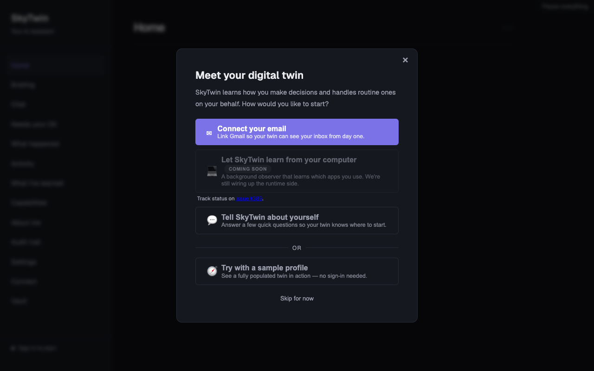
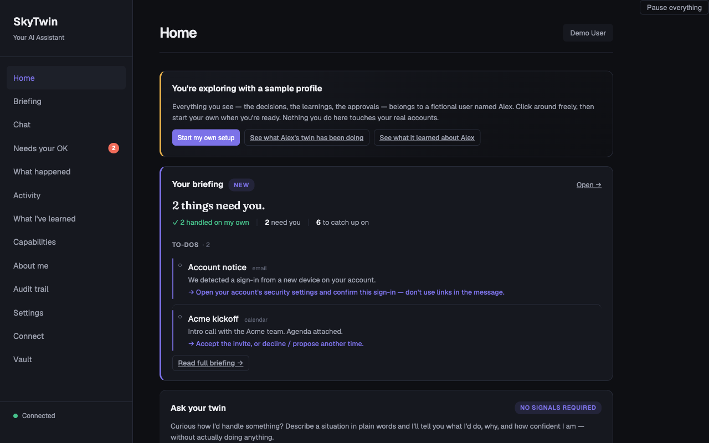
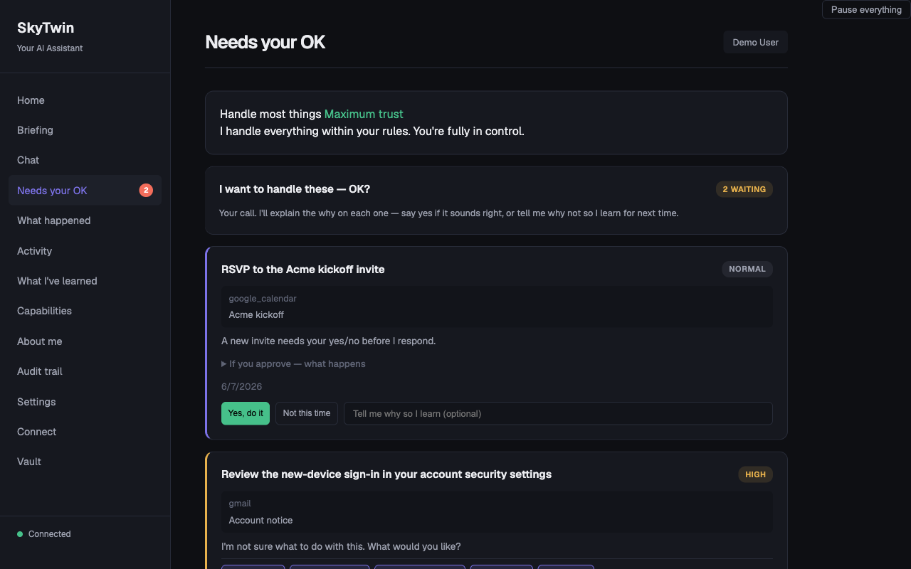
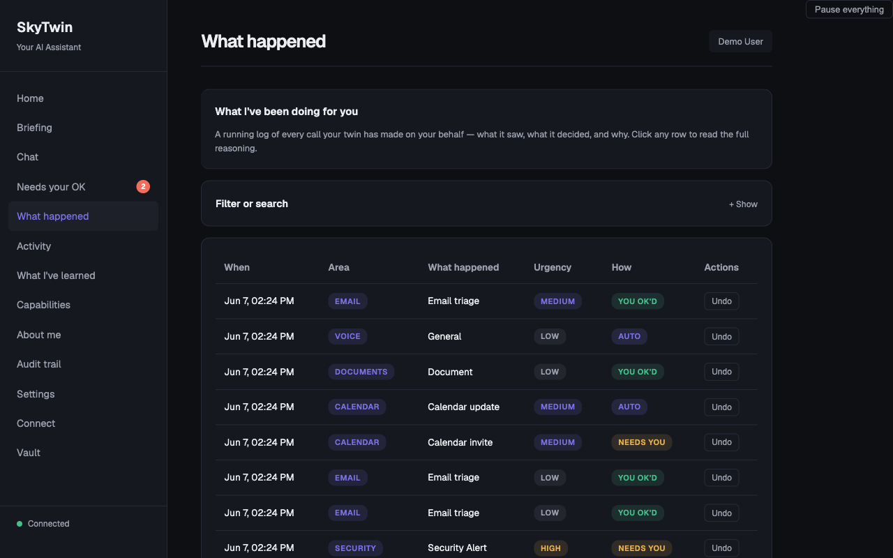
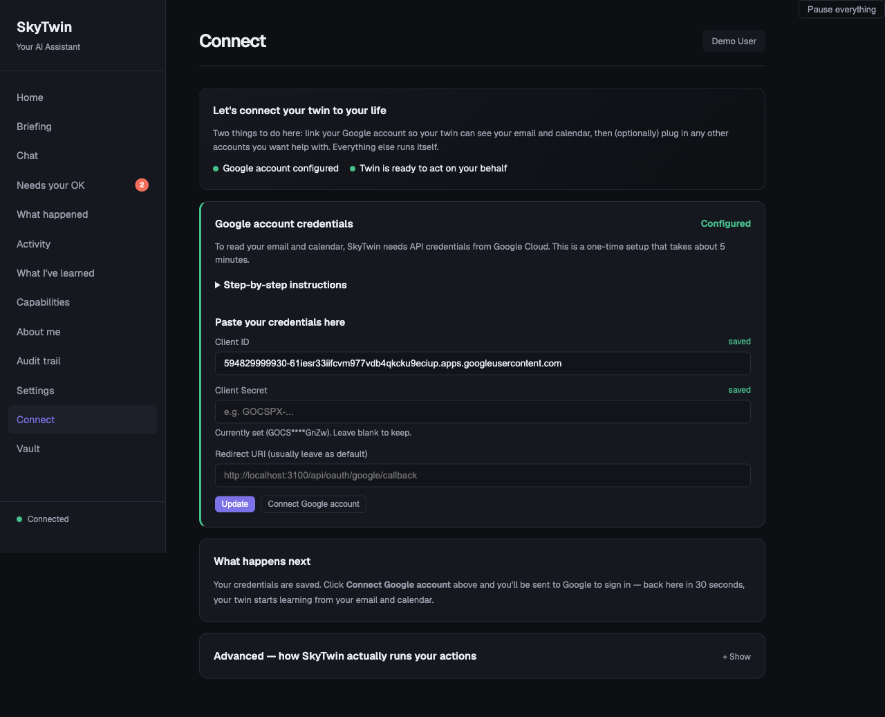
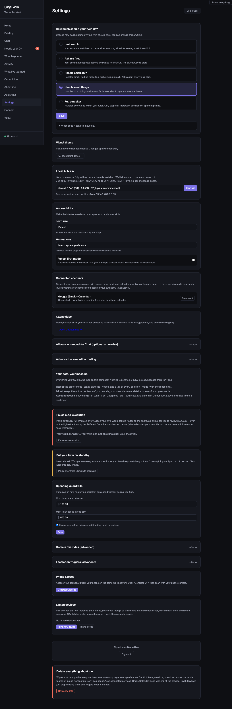
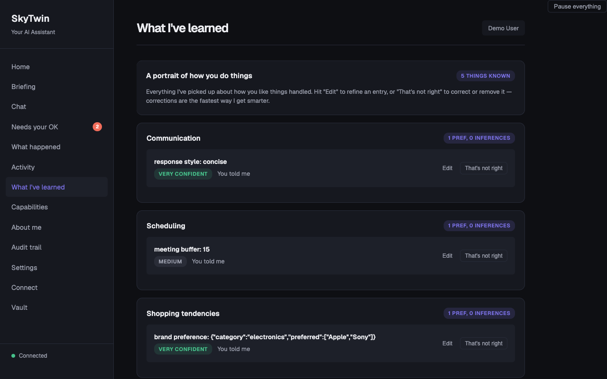

<div align="center">

# SkyTwin

**A digital twin that learns what you'd want — and does it.**

<a href="https://github.com/jayzalowitz/skytwin/actions/workflows/build.yml"></a>
<a href="https://github.com/jayzalowitz/skytwin/blob/main/LICENSE"></a>


</div>

---

Every personal assistant today has amnesia. You tell it you prefer aisle seats three times. It asks again. You archive the same newsletter every morning. It keeps notifying you. Every interaction starts from scratch.

SkyTwin is different. It builds a structured model of your preferences, risk tolerances, and decision patterns — a **digital twin** — then uses that model to act on your behalf. When it's confident, it just handles things. When it's not, it asks the right question instead of the wrong one.

**The core principle: ask the twin before asking the user.**

## How It Works

```
  Gmail, Calendar, etc.
         │
         ▼
  ┌──────────────┐
  │   Connectors  │  Ingest signals from your accounts
  └──────┬───────┘
         ▼
  ┌──────────────┐
  │   Decision    │  "What's happening? What would
  │   Engine      │   the user want here?"
  └──────┬───────┘
         ▼
  ┌──────────────┐
  │  Twin Model   │  Your preferences, patterns,
  │  + MemPalace  │  and episodic memory
  └──────┬───────┘
         ▼
  ┌──────────────┐
  │   Policy      │  Spend limits, trust tiers,
  │   Engine      │  safety constraints
  └──────┬───────┘
         ▼
    ┌────┴────┐
    ▼         ▼
 Auto-     Escalate
 execute   with context
    │         │
    ▼         ▼
 Explain   You decide
    │         │
    └────┬────┘
         ▼
  ┌──────────────┐
  │  Feedback     │  Your response trains the twin
  │  Loop         │  to be better next time
  └──────────────┘
```

Every path produces an explanation. Every outcome feeds back into the twin. The system gets better at predicting what you want over time.

## Screenshots

<table>
<tr>
<td width="50%">
<p align="center"><strong>Onboarding</strong></p>

</td>
<td width="50%">
<p align="center"><strong>Dashboard</strong></p>

</td>
</tr>
<tr>
<td width="50%">
<p align="center"><strong>Approvals</strong></p>

</td>
<td width="50%">
<p align="center"><strong>Decision History</strong></p>

</td>
</tr>
<tr>
<td width="50%">
<p align="center"><strong>Setup &amp; Credentials</strong></p>

</td>
<td width="50%">
<p align="center"><strong>Settings</strong></p>

</td>
</tr>
<tr>
<td width="50%">
<p align="center"><strong>My Learnings</strong></p>

</td>
<td width="50%">
</td>
</tr>
</table>

## Concrete Examples

| Scenario | What SkyTwin Does |
|----------|-------------------|
| **Newsletter arrives** | Your twin knows you archive these without reading. Auto-archived. Explanation logged. You never see it. |
| **Calendar conflict** | You always prioritize skip-level 1:1s over standups. Standup rescheduled with a note to the organizer. |
| **Subscription renewal** | $15.99/mo streaming service, used 3x this month, 18 months of renewals. Auto-renewed within your spend norms. |
| **Grocery reorder** | Repeats your last order with your substitution rules. Flags the one item that jumped 15% in price. |
| **Flight booking** | Finds the United aisle seat, morning departure, direct, $380. At high trust: books it. At low trust: presents top 3 options. |
| **Unknown sender email** | Low confidence. Escalates with a one-line summary so you can decide in 5 seconds instead of 5 minutes. |

## What Makes This Different

**It's not a chatbot.** SkyTwin is operational, not conversational. It doesn't wait for you to type a prompt — it watches your connected accounts and acts when opportunities arise.

**It earns trust incrementally.** New users start at `observer` — the system only suggests. As you approve and correct, it earns autonomy domain by domain. Trust in email triage doesn't mean trust with your calendar.

**Safety constraints are the product.** Every action passes through a policy engine with hard spend limits, trust tier gating, reversibility checks, and sensitivity classification. The system can be inspected, overridden, narrowed, and shut off at any time. [Read the full safety model →](./docs/safety-model.md)

**Every action is explainable.** No black boxes. Every automated decision produces an explanation record: what happened, what evidence was used, what preferences were invoked, why this action over alternatives, and how to correct it.

**Your twin is inspectable.** It's not a vector embedding or a bag of keywords. It's a typed, versioned data structure where every preference has a confidence level, supporting evidence, and provenance. Contradictions are tracked, not hidden.

## Quick Start

### One-command install (macOS, Linux, WSL)

```bash
curl -fsSL https://raw.githubusercontent.com/jayzalowitz/skytwin/main/install.sh | bash
```

That's it. The installer detects your OS, installs anything missing (Homebrew on mac, Node 20+, pnpm, Docker, Ollama), clones the repo to `~/skytwin`, runs the bootstrap, starts the services, and opens the dashboard at `http://localhost:3200` once it's up. Re-running pulls latest and restarts.

To stop later: `cd ~/skytwin && ./bin/skytwin-dev --stop`.

**The first 60 seconds:**
1. The dashboard opens. Type any situation into "Ask your twin" — the agent reasons out loud and explains what it would do, with confidence and alternatives. No accounts connected yet, no signals required.
2. Click **"Or explore with a sample profile first →"** to skip the OAuth setup entirely and poke at a fully populated example twin (decisions, learnings, approvals, the whole thing).
3. When you're ready to wire up your own, the in-app walkthrough handles the Google API setup in about 5 minutes — paste your client ID, click "Save and connect now," and you're at Google's sign-in.

### Manual setup

If you'd rather drive each step yourself:

**Prerequisites**

- [Node.js](https://nodejs.org/) >= 20
- [pnpm](https://pnpm.io/) >= 9
- [Docker](https://www.docker.com/) (for CockroachDB)

```bash
git clone https://github.com/jayzalowitz/skytwin.git && cd skytwin
pnpm install

# Start the database
docker-compose up -d cockroachdb

# Configure
cp .env.example .env   # edit with your values

# Migrate and seed
pnpm db:migrate
pnpm db:seed

# Build and run
pnpm build
pnpm dev
```

The API starts on `localhost:3100`, the web dashboard on `localhost:3200`.

### Running Tests

```bash
pnpm test   # ~2,985 tests across 36 workspace packages
```

## Architecture

SkyTwin is a TypeScript monorepo (pnpm + Turborepo) with 29 packages and 7 apps:

```
apps/
  api/                HTTP API — decisions, user management, webhooks, /api/voice/*
  web/                Dashboard — review decisions, manage preferences, configure policies
  worker/             Background jobs — async execution, briefing generation, tier backfill
  desktop/            Electron app — macOS (.dmg), Windows (.exe), Linux (.AppImage)
  mobile/             React Native (Expo) — QR pairing, push notifications, SSE, voice capture
  openclaw-bridge/    OpenClaw proxy — bridges local API to OpenClaw execution service
  twin-mcp-server/    MCP server exposing the twin's read-only surface to external clients

packages/
  shared-types/                   TypeScript interfaces — the dependency root for everything
  config/                         Env var loading and validation
  core/                           Retry logic, circuit breaker, error types, logging
  db/                             CockroachDB client, migrations, repositories
  twin-model/                     Twin profile CRUD, preference learning, confidence scoring
  decision-engine/                Event interpretation, candidate generation, action selection
  policy-engine/                  Trust tiers, spend limits, domain policies, safety checks
  policy-prompts/                 Versioned LLM prompts with JSON schema validation and deterministic fallbacks
  ironclaw-adapter/               Execution adapter with HMAC auth, retries, circuit breaker
  execution-router/               Adapter selection, fallback chains, risk modifiers, plugin discovery
  llm-client/                     Unified LLM client — Anthropic / OpenAI / Google / Ollama / embedded
  embedded-llm/                   Local-first: llama.cpp text, whisper.cpp STT, Piper TTS — spawn-based
  explanations/                   Human-readable explanation generation
  connectors/                     Gmail / Calendar / mock connectors with OAuth, stamps AuthoringTier
  assistant/                      Stateless chat service wrapping LlmClient with context enrichment
  capability-engine/              Infers user app capabilities from signals (keyword v1 + LLM verification)
  credential-vault/               Envelope encryption for OAuth tokens (AES-256-GCM + scrypt KDF)
  idle-miner/                     Filesystem scanner that extracts project metadata during idle time
  mcp-host/                       Manages MCP servers (stdio/HTTP/SSE) with circuit breakers + telemetry
  dxt/                            Serializes/deserializes DXT artifacts (packed MCP server configs)
  observability/                  In-memory metrics + ring-buffered rollup for the capability loop
  registry-client/                Loads curated MCP registry entries with OAuth quirks and service lookup
  mempalace/                      Legacy memory: episodic, knowledge graph, 4-layer retrieval (opt-in backend)
  memory-port/                    Backend-agnostic MemoryPort interface + capability negotiation
  memory-gbrain/                  Default memory backend — vector + tsvector RRF on CRDB brain_* tables
  memory-gbrain-crdb-adapter/     CRDB driver for gbrain — tier-weighted RRF, pin/hide, embedding providers
  memory-hybrid/                  Composes any two MemoryPort impls — per-capability read routing
  memory-mempalace/               MemoryPort adapter for the legacy mempalace classes
  evals/                          Decision quality evaluation and regression testing
```

### Tech Stack

| Layer | Technology |
|-------|-----------|
| Language | TypeScript (strict, ES2022) |
| Database | CockroachDB (PostgreSQL wire protocol) |
| Runtime | Node.js >= 20 |
| Package Manager | pnpm with workspaces |
| Build | Turborepo |
| Desktop | Electron + electron-builder |
| Mobile | React Native + Expo |
| Testing | Vitest (1,436 tests) |
| CI/CD | GitHub Actions |
| Execution | [IronClaw](https://github.com/nearai/ironclaw/) |

## Deployment

### Reverse proxies and `TRUST_PROXY_HOPS`

The API uses `req.ip` for every IP-keyed check: the session-auth
localhost dev-bypass, the OAuth new-user rate limit, the
`/api/v1/demo/preview` per-IP bucket, and any future per-client limit.
Behind any reverse proxy, `req.ip` is the proxy's address by default —
which collapses every per-IP limit into a single shared bucket. You
need `TRUST_PROXY_HOPS` set to the exact number of trusted hops between
the Node process and the real client.

The number you want is "trusted proxies between this Node process and the
actual client" — count every box that legitimately appends to
`X-Forwarded-For` on its way in, including any platform-injected router
your provider sits behind.

| Topology | `TRUST_PROXY_HOPS` |
|----------|--------------------|
| Direct (no proxy, or untrusted upstream) | `0` (default) |
| Single reverse proxy (your own nginx, Caddy, ELB target) | `1` |
| Single platform hop (Fly's edge, Render's router, Heroku's app router, an AWS ALB on its own) | `1` |
| CDN → your reverse proxy (Cloudflare → nginx → Node, no platform router) | `2` |
| CDN → platform router → Node (Cloudflare → Fly/Render/Heroku → Node) | `2` |
| CDN → platform router → your reverse proxy → Node (Cloudflare → Fly → nginx → Node) | `3` |
| Multi-hop edge (Cloudflare → AWS WAF → ALB → Node) | `3+` |

If you can't draw the topology from memory, prefer Express's array/CIDR
form for `trust proxy` (set per-network, not per-hop) — see the
[Express docs](https://expressjs.com/en/guide/behind-proxies.html). Hop
counts are simple but brittle when a platform inserts a hop you didn't
know about.

**Setting this too high is a security hole.** A client-controlled
`X-Forwarded-For` becomes `req.ip` and bypasses every per-IP limit by
header rotation. **When in doubt, prefer fewer hops.**

Verify after deploy:

```bash
curl -H 'X-Forwarded-For: 1.2.3.4' https://your-api/api/health/live
# response includes {"clientIp": "..."} — should NOT be "1.2.3.4"
# unless 1.2.3.4 is actually a trusted upstream
```

If `clientIp` in the response matches the spoofed header, your
`TRUST_PROXY_HOPS` is too permissive and rate-limit bypass is open.

### Public demo preview (`/api/v1/demo/preview`)

The public LLM-backed preview endpoint has three layers of protection:

| Env var | Default | Purpose |
|---------|---------|---------|
| `DEMO_PREVIEW_DISABLED` | unset | Set to `1` to return 503 unconditionally — operator kill switch when the endpoint gets abused. |
| `DEMO_PREVIEW_GLOBAL_LIMIT_PER_HOUR` | `500` | Hard global cap across all callers. Survives misconfigured `TRUST_PROXY_HOPS` and rotated-IP abuse. |
| Per-IP bucket | 20 / 5 min | Built in. Effectiveness depends on `TRUST_PROXY_HOPS` resolving the real client IP. |

The per-IP bucket and the global cap are process-local. If you run
multiple API replicas, the global cap multiplies by replica count.
For unauthenticated public deployments at scale, replace the
in-memory counter with Redis or a DB row with atomic increment
(tracked in TODOS.md as a P3).

## Trust Tiers

SkyTwin uses a progressive trust model. Autonomy is earned, not assumed.

| Tier | What It Means |
|------|---------------|
| `observer` | System watches and suggests. Never acts. Default for new users. |
| `suggest` | Drafts actions for your review. You approve or edit before anything happens. |
| `low_autonomy` | Auto-executes low-risk, reversible actions in trusted domains. Escalates everything else. |
| `moderate_autonomy` | Handles most routine decisions. Escalates novel situations and high-cost actions. |
| `high_autonomy` | Acts on your behalf across domains. Still respects hard limits and irreversibility checks. |

Trust is **domain-specific**. You might be at `moderate_autonomy` for email but `suggest` for calendar. A bad decision in one domain can reduce trust in that domain without affecting others.

## Documentation

| Document | What's Inside |
|----------|---------------|
| [Product Spec](./docs/product-spec.md) | Vision, target user, operating principles, example workflows |
| [Technical Spec](./docs/technical-spec.md) | Architecture, data flow, API endpoints, database schema |
| [Safety Model](./docs/safety-model.md) | Threat model, trust tiers, defense layers, safety philosophy |
| [Decision Engine](./docs/decision-engine.md) | Situation interpretation, risk assessment, confidence scoring |
| [IronClaw Integration](./docs/ironclaw-integration.md) | Execution adapter, HMAC auth, failure handling |
| [CockroachDB Architecture](./docs/cockroach-architecture.md) | Schema design (18+ tables), query patterns, versioning |
| [Evals](./docs/evals.md) | Evaluation harness, scenario simulation, calibration metrics |

## Project Status

SkyTwin is in **active development** (v0.6.21.0). The core decision pipeline, twin model, policy engine, and memory palace are functional. Gmail and Google Calendar connectors work with real OAuth. Desktop builds ship for all three platforms. The mobile app pairs via QR code and can capture voice. v0.5.0.0 brought the one-command installer and a non-technical-user UX overhaul; v0.5.1.0 through v0.5.4.0 closed the post-/review follow-ups; the v0.6 series added the embedded local LLM (#187), tier-aware memory retrieval (#251), per-Lifebook surfaces (#193), and the voice loop (mobile capture + Piper TTS).

**What works today:**
- One-command install (`curl | bash`) on macOS, Linux, and WSL — installs every dependency, clones the repo, starts the services, opens the dashboard
- "Ask your twin" widget on the dashboard — type any situation, get a predicted action with reasoning and confidence, no accounts required
- Tour mode with a fully populated sample profile so you can poke at decisions, learnings, and approvals before connecting your own accounts
- Full decision pipeline: signal → interpret → decide → policy check → execute/escalate → explain → learn
- LLM-powered decisions via configurable provider chain (Claude, GPT, Gemini, Ollama) with automatic fallback to built-in rules
- Twin model with versioned profiles, confidence scoring, and preference learning
- Policy engine with spend limits, trust tiers, and domain-specific rules
- Swappable memory backend: gbrain (default — vector + tsvector RRF on CRDB) plus optional hybrid mode that adds the legacy spatial Memory Palace (#197). Selectable per-installation via `MEMORY_BACKEND` and per-user via the dashboard. See [`docs/memory-swap.md`](./docs/memory-swap.md).
- Web dashboard for reviewing decisions, managing preferences, configuring AI providers, and auditing
- Desktop app (macOS, Windows, Linux) with system-browser OAuth for Google accounts
- Mobile app (iOS, Android) with QR pairing, push notifications, and voice capture that ships audio to the paired desktop for transcription
- Embedded local LLM stack: llama.cpp text, whisper.cpp STT, Piper TTS (`/api/voice/transcribe` and `/api/voice/synthesize`) — runs entirely on-device when binaries + models are present
- SSRF-safe URL validation for all LLM provider endpoints, with DNS rebinding protection
- Dynamic adapter discovery for third-party execution plugins
- 1,436 tests with CI/CD on GitHub Actions

**What's next:**
- More connectors (Slack, Notion, bank feeds)
- Hosted version with multi-tenant support
- Improved preference learning from implicit signals

## Contributing

We welcome contributions. See [CONTRIBUTING.md](./CONTRIBUTING.md) for guidelines on getting started, running tests, and submitting pull requests.

## Security

Found a vulnerability? See [SECURITY.md](./SECURITY.md) for responsible disclosure instructions.

## License

[Apache License 2.0](./LICENSE) — use it, modify it, build on it.
