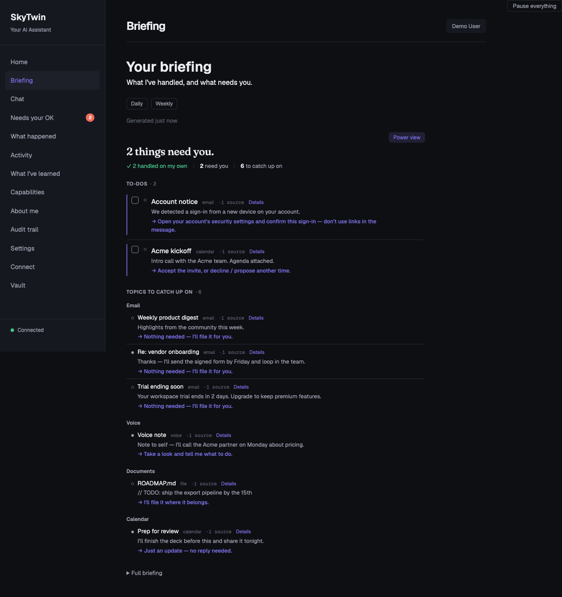

<div align="center">

# SkyTwin

**A digital twin that learns what you'd want — and does it.**

<a href="https://github.com/jayzalowitz/skytwin/actions/workflows/build.yml"></a>
<a href="https://github.com/jayzalowitz/skytwin/blob/main/LICENSE"></a>

<a href="https://github.com/jayzalowitz/skytwin/releases/latest"></a>


</div>

---

Every personal assistant today has amnesia. You tell it you prefer aisle seats three times. It asks again. You archive the same newsletter every morning. It keeps notifying you. Every interaction starts from scratch.

SkyTwin is different. It builds a structured model of your preferences, risk tolerances, and decision patterns — a **digital twin** — then uses that model to act on your behalf. When it's confident, it just handles things. When it's not, it asks the right question instead of the wrong one.

**The core principle: ask the twin before asking the user.**

## How It Works

```
  Gmail, Calendar, etc.
         │
         ▼
  ┌──────────────┐
  │   Connectors  │  Ingest signals from your accounts
  └──────┬───────┘
         ▼
  ┌──────────────┐
  │   Decision    │  "What's happening? What would
  │   Engine      │   the user want here?"
  └──────┬───────┘
         ▼
  ┌──────────────┐
  │  Twin Model   │  Your preferences, patterns,
  │  + Memory     │  and episodic memory (gbrain default,
  │               │  MemPalace optional)
  └──────┬───────┘
         ▼
  ┌──────────────┐
  │   Policy      │  Spend limits, trust tiers,
  │   Engine      │  safety constraints
  └──────┬───────┘
         ▼
    ┌────┴────┐
    ▼         ▼
 Auto-     Escalate
 execute   with context
    │         │
    ▼         ▼
 Explain   You decide
    │         │
    └────┬────┘
         ▼
  ┌──────────────┐
  │  Feedback     │  Your response trains the twin
  │  Loop         │  to be better next time
  └──────────────┘
```

Every path produces an explanation. Every outcome feeds back into the twin. The system gets better at predicting what you want over time.

## Screenshots

<table>
<tr>
<td width="50%">
<p align="center"><strong>Onboarding</strong></p>

</td>
<td width="50%">
<p align="center"><strong>Dashboard</strong></p>

</td>
</tr>
<tr>
<td width="50%">
<p align="center"><strong>Approvals</strong></p>

</td>
<td width="50%">
<p align="center"><strong>Decision History</strong></p>

</td>
</tr>
<tr>
<td width="50%">
<p align="center"><strong>Setup &amp; Credentials</strong></p>

</td>
<td width="50%">
<p align="center"><strong>Settings — fresh capture pending</strong></p>
<p>The current source adds an explicit saved reasoning-location boundary and accurate local-storage and remote-processing disclosures. The older full-page image was removed because it predates those controls.</p>
</td>
</tr>
<tr>
<td width="50%">
<p align="center"><strong>My Learnings</strong></p>

</td>
<td width="50%">
<p align="center"><strong>Daily Briefing</strong></p>

</td>
</tr>
</table>

## Concrete Examples

| Scenario | What SkyTwin Does |
|----------|-------------------|
| **Newsletter arrives** | Your twin knows you archive these without reading. Auto-archived. Explanation logged. You never see it. |
| **Calendar conflict** | You always prioritize skip-level 1:1s over standups. Standup rescheduled with a note to the organizer. |
| **Subscription renewal** | $15.99/mo streaming service, used 3x this month, 18 months of renewals. Auto-renewed within your spend norms. |
| **Grocery reorder** | Repeats your last order with your substitution rules. Flags the one item that jumped 15% in price. |
| **Flight booking** | Finds the United aisle seat, morning departure, direct, $380. At high trust: books it. At low trust: presents top 3 options. |
| **Unknown sender email** | Low confidence. Escalates with a one-line summary so you can decide in 5 seconds instead of 5 minutes. |

## What Makes This Different

**It's not a chatbot.** SkyTwin is operational, not conversational. It doesn't wait for you to type a prompt — it watches your connected accounts and acts when opportunities arise.

**It earns trust incrementally.** New users start at `observer` — the system only suggests. As you approve and correct, it earns autonomy domain by domain. Trust in email triage doesn't mean trust with your calendar.

**Safety constraints are the product.** Every action passes through a policy engine with hard spend limits, trust tier gating, reversibility checks, and sensitivity classification. The system can be inspected, overridden, narrowed, and shut off at any time. [Read the full safety model →](./docs/safety-model.md)

**Every action is explainable.** No black boxes. Every automated decision produces an explanation record: what happened, what evidence was used, what preferences were invoked, why this action over alternatives, and how to correct it.

**Your twin is inspectable.** It's not a vector embedding or a bag of keywords. It's a typed, versioned data structure where every preference has a confidence level, supporting evidence, and provenance. Contradictions are tracked, not hidden.

**Memory knows who said what.** Signals from supported connectors arrive stamped with an authoring tier — content you wrote vs. a newsletter vs. an inbound stranger — and tier-weighted retrieval lets self-authored content outrank broadcast noise. The twin feels like it knows *you* instead of just having read your inbox.

## Quick Start

### Download and install (no terminal)

**[⬇ Download the latest release →](https://github.com/jayzalowitz/skytwin/releases/latest)**

Grab the installer for your OS, double-click, and you're in. No terminal, Docker,
Ollama, or `.env` is required to open the app. CockroachDB ships inside the bundle
as a hash-verified native binary. Check the release notes for the exact features in
that artifact. In builds from current source, a local model and the `llama.cpp`
runtime are not bundled: SkyTwin recommends a maintained artifact for the machine
and downloads it only after the user starts the install. A compatible runtime
remains a separate prerequisite, while a cloud provider remains an explicit opt-in.

> **Release boundary:** published installers currently predate the guarded,
> account-free sample session and verified managed-model delivery in this source
> tree. Check the release notes for the exact features in an artifact. Desktop
> builds produced from current source
> can open a short-lived sample whose database-backed surface remains read-only;
> approve, reject, correct, and learn interactions run only in a separate,
> session-local simulation that cannot reach providers or execution adapters.
> Its browser credential is tab-scoped and [bypasses offline caching and replay](./apps/web/public/js/pwa/sw-policy.js).

| OS | Installer on the release page |
|----|-------------------------------|
| **macOS** (Apple Silicon) | `SkyTwin-…-arm64.dmg` |
| **Windows** | `SkyTwin.Setup.….exe` |
| **Linux** | `SkyTwin-….AppImage`, `.deb`, or `.rpm` |

> **⚠ Unsigned builds (for now).** Code-signing certs (Apple Developer + Windows EV) are a pending launch step, so your OS warns on first launch:
> - **macOS:** right-click the app → **Open** → **Open** (clears Gatekeeper once).
> - **Windows:** SmartScreen → **More info** → **Run anyway**.
>
> Signing is required before a public launch; until then this is the expected first-run experience.

### Build from source (one-command, macOS / Linux / WSL)

```bash
curl -fsSL https://raw.githubusercontent.com/jayzalowitz/skytwin/main/install.sh | bash
```

The installer detects your OS, installs anything missing (Homebrew on mac, Node 20+, pnpm), fetches the official CockroachDB single-node binary (hash-verified), clones the repo to `~/skytwin`, runs the bootstrap, starts the services, and opens the dashboard at `http://localhost:3200` once it's up. Re-running pulls latest and restarts.

**No Docker required.** Before v0.6.56 the installer pulled Docker Desktop and ran CockroachDB inside a container — by far the heaviest dependency on the list, with its own EULA and a "open it once after install" gotcha. The default path now installs the CRDB binary directly into `~/.local/share/skytwin/bin/cockroach` and spawns it as a child process. Docker remains supported via `SKYTWIN_USE_DOCKER=true` for users who already have a Docker workflow.

To stop later: `cd ~/skytwin && ./bin/skytwin-dev --stop`.

**The first 60 seconds in a development/source run:**
1. The dashboard opens. Type any situation into "Ask your twin" — the agent reasons out loud and explains what it would do, with confidence and alternatives. No accounts connected yet, no signals required.
2. After `pnpm db:seed`, click **"Just show me around"** on the welcome screen to skip OAuth and use the development demo seed. Alex has recent decisions, a daily briefing, four pending approvals, "What I've learned", Capabilities, Search, and a trust bar climbing toward "handle most things". The development seed also includes Pat (a power user) and Carol (a brand-new user), so the dev "Switch user" button tells three stories. This development path can exercise mock approval actions; it is separate from the packaged build's read-only data authority and isolated, non-persistent simulation.
3. The welcome screen recommends a local model from the machine's RAM, architecture, and free disk. The current maintained catalog contains one pinned Qwen2.5 1.5B Instruct Q4_K_M artifact (about 1.0 GiB). The artifact is downloaded on request and must pass exact-size, SHA-256, registry, and runtime-compatibility checks before automatic discovery will load it. A compatible llama.cpp binary remains a separate prerequisite. "Change" opens Settings → AI (and the local memory backend).
4. Want to look around first? Press **Esc**, click the **×** in the modal corner, or hit **Skip for now** — the dashboard chrome stays navigable behind the modal, and a "Sign in" button on the placeholder gets you back into the wizard whenever you're ready.
5. When you're ready to wire up your own, the in-app walkthrough handles the Google API setup in about 5 minutes — paste your client ID, click "Save and connect now," and you're at Google's sign-in.

### Advanced env vars

The defaults start SkyTwin without any LLM API keys or Docker. Local inference still requires both a verified model artifact and a compatible llama.cpp runtime. Power users can opt into:

| Env var | Effect |
|---------|--------|
| `SKYTWIN_USE_DOCKER=true` | Run CockroachDB inside Docker instead of as a native binary. Useful for users who already have Docker and prefer container lifecycle. |
| `SKYTWIN_DOCKER_SQL_PORT`, `SKYTWIN_DOCKER_ADMIN_PORT`, `SKYTWIN_DOCKER_API_PORT` | Override Docker Compose host ports for SQL, the Cockroach admin UI, and the optional API container. Useful when another Conductor workspace or local stack already owns `26257`, `8080`, or `3000`. |
| `TURBO_DEV_CONCURRENCY` | Override the `pnpm dev` Turbo concurrency. The default is `50`, high enough for the current persistent dev task count. |
| `SKYTWIN_DEV_SKIP_PORT_PREFLIGHT=1` | Bypass the `pnpm dev` port preflight. Use only when you intentionally want Turbo to try starting even though a required dev port is already listening. |
| `SKYTWIN_WITH_OLLAMA=true` | Install Ollama + pull the gemma4 model (~9.6GB). Without this opt-in, local inference requires a separately installed `llama.cpp` binary and compatible model. |
| `SKYTWIN_DISABLE_EMBEDDED=1` | Skip the embedded LLM provider in the API's provider chain. Pair with hosted-only keys (e.g. `ANTHROPIC_API_KEY`) for reproducible evaluation runs. |
| `SKYTWIN_LLAMA_MODEL=/path/model.gguf` | Opt into a user-managed model path. This explicit override bypasses the managed-model manifest and registry checks; the user is responsible for the artifact's provenance and compatibility. |
| `SKYTWIN_REASONING_MODE` | Pin the environment-driven chain to `on_device` or `bring_your_own_provider`. Mixed local/remote chains require this explicit choice; `verified_private_cloud` remains unavailable until a verified adapter ships. |
| `SKYTWIN_CRDB_VERSION` | Pin a non-default CockroachDB version. Refresh the hash tables in `bin/skytwin-db` and `apps/desktop/scripts/build-single-binary.sh` together. |

On-device Ollama requires Ollama 0.18 or newer. SkyTwin adds Ollama's
request-scoped `:local` source selector to every on-device call and never
retries the unqualified model name; this prevents a loopback daemon from
relaying a remote-backed model alias. For defense in depth, disable Ollama
Cloud globally with `OLLAMA_NO_CLOUD=1` or `disable_ollama_cloud: true`.

### Manual setup

If you'd rather drive each step yourself:

**Prerequisites**

- [Node.js](https://nodejs.org/) >= 20
- [pnpm](https://pnpm.io/) >= 9
- That's it. CockroachDB is fetched as a native binary by `bin/skytwin-db install`. No Docker, no system DB install.

```bash
git clone https://github.com/jayzalowitz/skytwin.git && cd skytwin
pnpm install

# Fetch + start CockroachDB (native binary, hash-verified)
./bin/skytwin-db install
./bin/skytwin-db start
./bin/skytwin-db ensure-db

# Configure
cp .env.example .env   # edit with your values

# Migrate and seed
pnpm db:migrate
pnpm db:seed

# Build and run
pnpm build
pnpm dev
```

The API starts on `localhost:3100`, the web dashboard on `localhost:3200`.
`pnpm dev` preflights the API, web, OpenClaw bridge, and Twin MCP ports before
Turbo starts. If another process owns a required port, it prints the owning
PID/command/cwd; if this same workspace is already healthy, it exits cleanly
instead of starting a duplicate dev stack.
The OpenClaw bridge is supervised during `pnpm dev`, so a one-off child
SIGKILL/exit 137 restarts the bridge without tearing down API/web/worker; fast
crash loops still fail visibly.

### Validating the install path

Before shipping, regression-check the install end-to-end across a matrix
of Linux distros:

```bash
./bin/validate-installs              # Ubuntu 22.04, Debian 12, Fedora 40
./bin/validate-installs ubuntu       # one distro
./bin/validate-installs --keep-on-fail ubuntu  # leave container alive on failure
```

Each run spawns a fresh OS container, untars a snapshot of the working
tree, runs `install.sh` exactly the way a real user would, and asserts
the dashboard responds at `localhost:3200`. macOS/Windows are exercised
via the same `install.sh` and `bin/skytwin-db` codepaths but need a real
machine to verify the platform-specific bits (Homebrew, NSIS, etc.).

### Running Tests

```bash
pnpm test   # 4,800+ tests across 400+ files in 30 packages + 8 apps
```

## Architecture

SkyTwin is a TypeScript monorepo (pnpm + Turborepo) with 30 packages and 8 apps:

```
apps/
  api/                HTTP API — decisions, user management, webhooks, /api/voice/*
  web/                Dashboard — review decisions, manage preferences, configure policies
  worker/             Background jobs — async execution, briefing generation, memory action loop, tier backfill
  idle-miner-runner/  Desktop-managed child that scans approved project roots only while the machine is idle
  desktop/            Electron app — macOS (.dmg), Windows (.exe), Linux (.AppImage)
  mobile/             React Native (Expo) — QR pairing, push notifications, SSE, voice capture
  openclaw-bridge/    OpenClaw proxy — bridges local API to OpenClaw execution service
  twin-mcp-server/    MCP server exposing the twin's read-only surface to external clients

packages/
  shared-types/                   TypeScript interfaces — the dependency root for everything
  config/                         Env var loading and validation
  core/                           Retry logic, circuit breaker, error types, logging
  db/                             CockroachDB client, migrations, repositories
  twin-model/                     Twin profile CRUD, preference learning, confidence scoring
  decision-engine/                Event interpretation, candidate generation, action selection
  policy-engine/                  Trust tiers, spend limits, domain policies, safety checks
  policy-prompts/                 Versioned LLM prompts with JSON schema validation and deterministic fallbacks
  ironclaw-adapter/               Execution adapter with HMAC auth, retries, circuit breaker
  execution-router/               Adapter selection, fallback chains, risk modifiers, plugin discovery
  llm-client/                     Unified LLM client — Anthropic / OpenAI / Google / Ollama / embedded
  embedded-llm/                   Local-first: llama.cpp text, whisper.cpp STT, Piper TTS — spawn-based
  explanations/                   Human-readable explanation generation
  connectors/                     Gmail / Google Calendar / Outlook mail+calendar / mock connectors with OAuth, stamps AuthoringTier
  assistant/                      Stateless chat service wrapping LlmClient with context enrichment
  capability-engine/              Infers user app capabilities from signals (keyword v1 + LLM verification)
  credential-vault/               Envelope encryption for OAuth tokens (AES-256-GCM + scrypt KDF)
  idle-miner/                     Filesystem scanner that extracts project metadata during idle time
  mcp-host/                       Manages MCP servers (stdio/HTTP/SSE) with circuit breakers + telemetry
  dxt/                            Serializes/deserializes DXT artifacts (packed MCP server configs)
  observability/                  In-memory metrics + ring-buffered rollup for the capability loop
  registry-client/                Loads curated MCP registry entries with OAuth quirks and service lookup
  routines/                       No-code Watches: plain-language → read-only digest/notify with scheduler, run history, briefing/chat/web surfaces
  mempalace/                      Legacy memory: episodic, knowledge graph, 4-layer retrieval (opt-in backend)
  memory-port/                    Backend-agnostic MemoryPort interface + capability negotiation
  memory-gbrain/                  Default memory backend — vector + tsvector RRF on CRDB brain_* tables
  memory-gbrain-crdb-adapter/     CRDB driver for gbrain — tier-weighted RRF, pin/hide, embedding providers
  memory-hybrid/                  Composes any two MemoryPort impls — per-capability read routing
  memory-mempalace/               MemoryPort adapter for the legacy mempalace classes
  evals/                          Decision quality evaluation and regression testing
```

### Tech Stack

| Layer | Technology |
|-------|-----------|
| Language | TypeScript (strict, ES2022) |
| Database | CockroachDB (PostgreSQL wire protocol) |
| Runtime | Node.js >= 20 |
| Package Manager | pnpm with workspaces |
| Build | Turborepo |
| Desktop | Electron + electron-builder |
| Mobile | React Native + Expo |
| Testing | Vitest (4,800+ tests) |
| CI/CD | GitHub Actions |
| Execution | [IronClaw](https://github.com/nearai/ironclaw/), OpenClaw (via local bridge), and a Direct fallback — trust-ranked with automatic failover |

## Deployment

### Reverse proxies and `TRUST_PROXY_HOPS`

The API uses `req.ip` for every IP-keyed check: the session-auth
localhost dev-bypass, the OAuth new-user rate limit, the
`/api/v1/demo/preview` per-IP bucket, and any future per-client limit.
Behind any reverse proxy, `req.ip` is the proxy's address by default —
which collapses every per-IP limit into a single shared bucket. You
need `TRUST_PROXY_HOPS` set to the exact number of trusted hops between
the Node process and the real client.

The number you want is "trusted proxies between this Node process and the
actual client" — count every box that legitimately appends to
`X-Forwarded-For` on its way in, including any platform-injected router
your provider sits behind.

| Topology | `TRUST_PROXY_HOPS` |
|----------|--------------------|
| Direct (no proxy, or untrusted upstream) | `0` (default) |
| Single reverse proxy (your own nginx, Caddy, ELB target) | `1` |
| Single platform hop (Fly's edge, Render's router, Heroku's app router, an AWS ALB on its own) | `1` |
| CDN → your reverse proxy (Cloudflare → nginx → Node, no platform router) | `2` |
| CDN → platform router → Node (Cloudflare → Fly/Render/Heroku → Node) | `2` |
| CDN → platform router → your reverse proxy → Node (Cloudflare → Fly → nginx → Node) | `3` |
| Multi-hop edge (Cloudflare → AWS WAF → ALB → Node) | `3+` |

If you can't draw the topology from memory, prefer Express's array/CIDR
form for `trust proxy` (set per-network, not per-hop) — see the
[Express docs](https://expressjs.com/en/guide/behind-proxies.html). Hop
counts are simple but brittle when a platform inserts a hop you didn't
know about.

**Setting this too high is a security hole.** A client-controlled
`X-Forwarded-For` becomes `req.ip` and bypasses every per-IP limit by
header rotation. **When in doubt, prefer fewer hops.**

Verify after deploy:

```bash
curl -H 'X-Forwarded-For: 1.2.3.4' https://your-api/api/health/live
# response includes {"clientIp": "..."} — should NOT be "1.2.3.4"
# unless 1.2.3.4 is actually a trusted upstream
```

If `clientIp` in the response matches the spoofed header, your
`TRUST_PROXY_HOPS` is too permissive and rate-limit bypass is open.

### Public demo preview (`/api/v1/demo/preview`)

The public LLM-backed preview endpoint has three layers of protection:

| Env var | Default | Purpose |
|---------|---------|---------|
| `DEMO_PREVIEW_DISABLED` | unset | Set to `1` to return 503 unconditionally — operator kill switch when the endpoint gets abused. |
| `DEMO_PREVIEW_GLOBAL_LIMIT_PER_HOUR` | `500` | Hard global cap across all callers. Survives misconfigured `TRUST_PROXY_HOPS` and rotated-IP abuse. |
| Per-IP bucket | 20 / 5 min | Built in. Effectiveness depends on `TRUST_PROXY_HOPS` resolving the real client IP. |

The per-IP bucket and the global cap are process-local. If you run
multiple API replicas, the global cap multiplies by replica count.
For unauthenticated public deployments at scale, replace the
in-memory counter with Redis or a DB row with atomic increment
(tracked in TODOS.md as a P3).

## Trust Tiers

SkyTwin uses a progressive trust model. Autonomy is earned, not assumed.

| Tier | What It Means |
|------|---------------|
| `observer` | Default for new users. The twin proposes actions and surfaces them as approval requests — you approve, reject, or edit. Never auto-executes. |
| `suggest` | Drafts actions for your review. You approve or edit before anything happens. |
| `low_autonomy` | Auto-executes low-risk, reversible actions in trusted domains. Escalates everything else. |
| `moderate_autonomy` | Handles most routine decisions. Escalates novel situations and high-cost actions. |
| `high_autonomy` | Acts on your behalf across domains. Still respects hard limits and irreversibility checks. |

Trust is **domain-specific**. You might be at `moderate_autonomy` for email but `suggest` for calendar. A bad decision in one domain can reduce trust in that domain without affecting others.

## Documentation

| Document | What's Inside |
|----------|---------------|
| [The Deck](https://jayzalowitz.github.io/skytwin/deck.html) | 22 slides: every capability claim paired with the mechanism that constrains it. Each claim-and-gate slide carries a collapsible source block citing the file and lines it came from; the "why now" and positioning slides cite external sources instead, and three narrative slides carry no citation block ([source](./docs/deck.html)) |
| [Product Spec](./docs/product-spec.md) | Vision, target user, operating principles, example workflows |
| [Technical Spec](./docs/technical-spec.md) | Architecture, data flow, API endpoints, database schema |
| [Safety Model](./docs/safety-model.md) | Threat model, trust tiers, defense layers, safety philosophy |
| [Decision Engine](./docs/decision-engine.md) | Situation interpretation, risk assessment, confidence scoring |
| [IronClaw Integration](./docs/ironclaw-integration.md) | Execution adapter, HMAC auth, failure handling |
| [CockroachDB Architecture](./docs/cockroach-architecture.md) | Schema design (18+ tables), query patterns, versioning |
| [Evals](./docs/evals.md) | Evaluation harness, scenario simulation, calibration metrics |
| [Launch Plan](./docs/launch-plan.md) | Procurement + sequencing to public download links |
| [Launch-Readiness Report](./docs/launch-readiness-report.md) | Current launch-blocker status: what's code-done vs. external |
| [Release Procedure](./docs/release-procedure.md) | How to cut a release (tag → build.yml → draft → publish) + signing and clean-artifact verification gates |

## Project Status

SkyTwin is in **Tier 1 launch polish** (see [`docs/launch-plan.md`](./docs/launch-plan.md)) — signed binaries, a verified packaged experience, the mobile cut, and safety/privacy debt remain pre-launch work tracked under epic [#357](https://github.com/jayzalowitz/skytwin/issues/357). The 2026-06-14 source audit ([`docs/launch-readiness-report.md`](./docs/launch-readiness-report.md)) verified the development tree at that revision; it was not certification of the currently published installers or of every public-launch gate. Published releases lag the current source. In this release candidate, the packaged account-free sample keeps its database-backed surface read-only while dedicated interactions run only inside an isolated, session-local simulation. The report retains the code-signing, OAuth review, mobile, artifact-validation, and encryption/key-management blockers. Core decision pipeline, twin model, policy engine, and swappable memory layer are functional in source; Gmail and Google Calendar connectors run with real OAuth; desktop packaging targets all three platforms; and the mobile source supports QR pairing and voice capture. Consult the release badge, [`CHANGELOG.md`](./CHANGELOG.md), and each release's notes for what a downloadable artifact actually contains.

**Free and open-source forever for personal use.** Team and hosted tiers are planned for organizations that need shared policies, audit logs, or managed infrastructure — see [`docs/launch-plan.md`](./docs/launch-plan.md) for the split.

**What works in the development/source tree today:**
- One-command install (`curl | bash`) on macOS, Linux, and WSL — installs every dependency, clones the repo, starts the services, opens the dashboard
- "Ask your twin" widget on the dashboard — type any situation, get a predicted action with reasoning and confidence, no accounts required
- A fully populated development demo seed with mock approval actions, plus a separate guarded sample session for packaged desktop builds. Its database-backed surface is read-only; a dedicated simulation can approve, reject, or correct fixed proposals and demonstrate session-local learning without invoking real connectors, providers, credentials, or execution adapters. Current published installers predate this packaged sample path.
- Inbox-Intelligence briefing — a daily/weekly digest that splits **to-dos (act)** from **topics (FYI)**, cites the source signal behind every item, persists memory-derived action opportunities, routes them through policy plus IronClaw/OpenClaw/Direct execution, reports queued/executed/blocked/learning-needed outcomes, and offers a "Power view" toggle for the technical detail behind each call
- Full decision pipeline: signal → interpret → decide → policy check → execute/escalate → explain → learn
- Mode-scoped model reasoning: on-device embedded/Ollama or an explicitly selected provider chain, with fallback contained inside the selected location boundary, request-scoped local-only enforcement for Ollama, and deterministic rules when no eligible provider responds
- Twin model with versioned profiles, confidence scoring, and preference learning
- Policy engine with spend limits, trust tiers, and domain-specific rules
- Swappable memory backend: gbrain (default — vector + tsvector RRF on CRDB) plus optional hybrid mode that adds the legacy spatial Memory Palace (#197). Selectable per-installation via `MEMORY_BACKEND` and per-user via the dashboard. See [`docs/memory-swap.md`](./docs/memory-swap.md).
- Web dashboard for reviewing decisions, managing preferences, configuring AI providers, and auditing
- Desktop app (macOS, Windows, Linux) with system-browser OAuth for Google accounts
- Mobile app (iOS, Android) with QR pairing, push notifications, and voice capture that ships audio to the paired desktop for transcription
- Embedded local LLM stack: llama.cpp text, whisper.cpp STT, Piper TTS (`/api/voice/transcribe` and `/api/voice/synthesize`) — runs entirely on-device when binaries + models are present
- SSRF-safe URL validation for all LLM provider endpoints, with DNS rebinding protection
- Dynamic adapter discovery for third-party execution plugins
- 4,800+ tests with CI/CD on GitHub Actions

**What's next:**
- More connectors (Slack, Notion, bank feeds)
- Hosted version with multi-tenant support
- Improved preference learning from implicit signals

## Contributing

We welcome contributions. See [CONTRIBUTING.md](./CONTRIBUTING.md) for guidelines on getting started, running tests, and submitting pull requests.

## Security

Found a vulnerability? See [SECURITY.md](./SECURITY.md) for responsible disclosure instructions.

## License

[Apache License 2.0](./LICENSE) — use it, modify it, build on it.

## How this stays alive

**Free and open source forever for personal use.** Future Team and Hosted tiers are planned for organizations that need shared policies, audit logs, or managed infrastructure. Personal features will never be paywalled.

No prices today — we're not ready to commit numbers, and overpromising on a backlog you haven't shipped is the easiest trust to lose. The shape of the future, not the price list.
